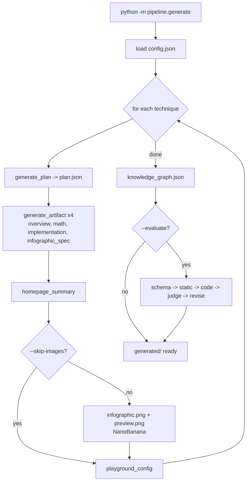
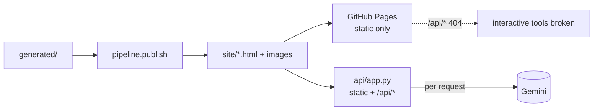
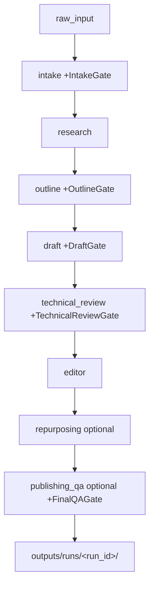
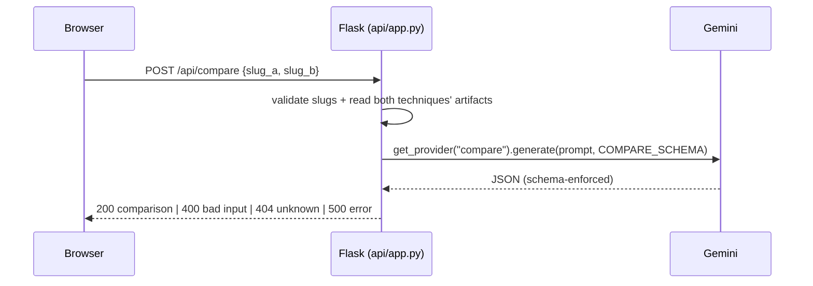

# Flow Diagrams

> Mermaid + text diagrams of the system's key flows. Render in any Mermaid-aware viewer.
> Last updated: 2026-05-28.

## Content generation pipeline (single-shot)



Each `generate_*` step: render `{{var}}` prompt → `get_provider(key)` → `generate_with_retry` (validate + ≤3 retries) → write JSON + manifest hash. Validation errors at this stage are logged, not blocking.

## Publish + serve



Note: CI publishes the **placeholder** (no generated content committed), so the Pages box is effectively the placeholder page.

## Multi-agent content pipeline (independent)



Gate failure with attempts left → NEEDS_REVISION (feedback fed back, stage re-run). Exhausted gate → SKIPPED (optional) or FAILED. Resume skips already-succeeded stages.

## Request flow — an API endpoint (e.g. /api/compare)



## LLM-as-judge (tool-using)

```mermaid
flowchart TD
  A[evaluate_artifact] --> B[build tool-using judge prompt]
  B --> C[generate_with_tools max 5 turns]
  C --> D{model calls a tool?}
  D -- yes --> E[dispatch: run_python_code / check_equation /\nlookup_reference / verify_imports]
  E --> C
  D -- no --> F[parse JSON -> validate JUDGE_OUTPUT_SCHEMA]
  F --> G{passed >= threshold?}
  G -- no --> H[build_revision_prompt -> revise -> re-judge\n(retry_loop, max 3)]
  G -- yes --> I[promote]
```

## Diagram maintenance
Update these when a pipeline stage, endpoint, or routing rule changes. They are intentionally coarse — see the architecture docs for file:line detail.
