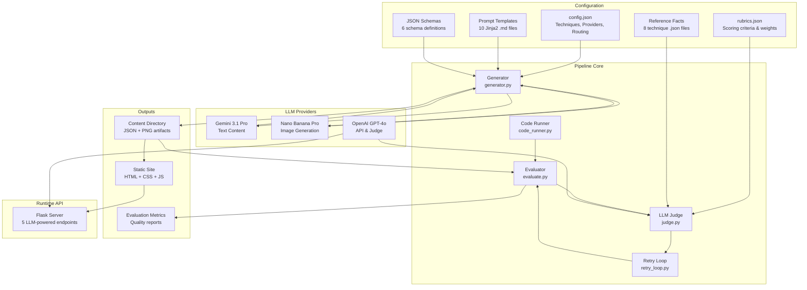
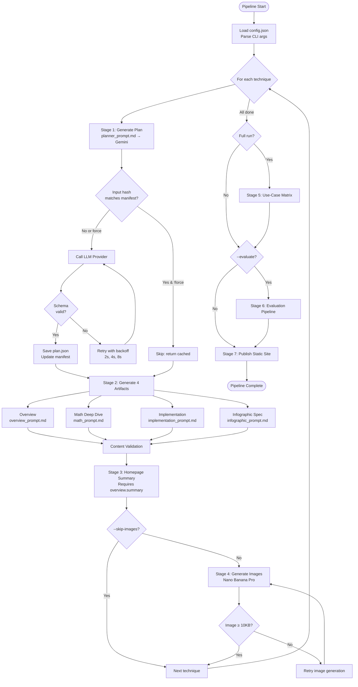
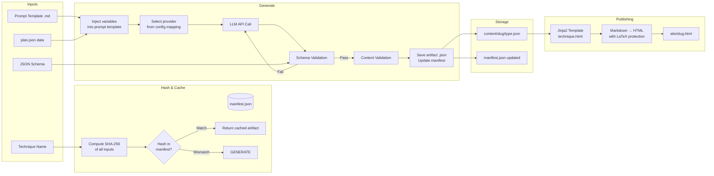
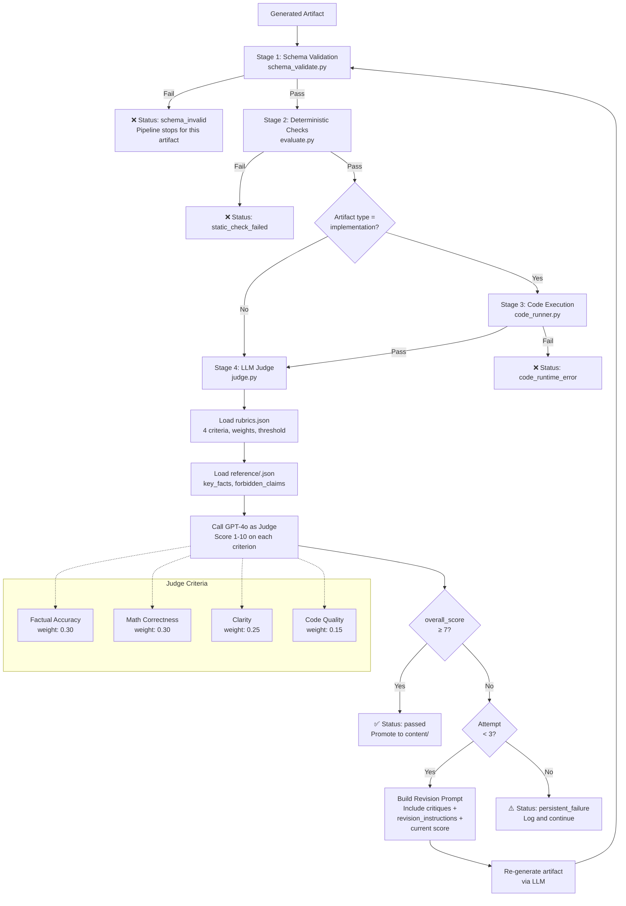

# Data Flow and System Diagrams

## A. High-Level System Diagram

### Mermaid Diagram



### What to notice
- **Three distinct LLM providers** serve different purposes — text, images, and runtime/judge
- **Configuration flows in from the left** — the pipeline is data-driven, not code-driven
- **The evaluation pipeline is a closed loop** — judge results feed back into retry/revision
- **Two output paths**: static site (batch) and Flask API (runtime)

### Why it matters
This diagram shows the system isn't a simple "prompt → output" pipeline. It has **feedback loops**, **multi-provider routing**, and **separation between batch generation and runtime serving**.

---

## B. Detailed Pipeline Data Flow Diagram

### Mermaid Diagram



### What to notice
- **Idempotency check** (hash comparison) happens before every LLM call
- **Retry logic** is at the LLM call level (API failures) and at the evaluation level (content quality)
- **Dependencies flow downward**: plan → artifacts → summary → images
- **Optional stages** (images, evaluation, matrix) are flag-controlled

### Why it matters
This shows the full execution path with all branch points and retry mechanisms. It demonstrates the pipeline isn't fragile — failures at any point are handled gracefully.

---

## C. Artifact Generation Flow

### Mermaid Diagram



### What to notice
- **Input hashing** creates a deterministic fingerprint of all generation inputs
- **Manifest acts as a cache** — if inputs haven't changed, generation is skipped entirely
- **Schema validation is in the retry loop** — LLM output must conform before being accepted
- **Content validation is post-schema** — catches semantic issues (word count, LaTeX, pseudocode)
- **Publishing is a separate stage** — artifacts are JSON; HTML is rendered from templates

### Why it matters
This diagram shows that every artifact has a **provenance chain**: inputs → hash → generation → validation → storage → publishing. Nothing is ad-hoc.

---

## D. Judge / Evaluation Flow

### Mermaid Diagram



### What to notice
- **Four stages, progressively expensive**: schema (instant) → static checks (instant) → code execution (30s max) → LLM judge (API call)
- **Each stage is a gate** — failure at any stage blocks subsequent stages
- **The retry loop feeds back** — judge output (critiques, instructions) becomes input for revision
- **Reference facts constrain the judge** — it knows what must be present and what must be absent
- **Implementation artifacts get extra validation** — sandboxed code execution

### Why it matters
This is the **core quality assurance mechanism**. It shows how the system achieves reliability from an inherently non-deterministic source (LLMs). The combination of deterministic and probabilistic checks is the key architectural insight.

---

## E. Extensibility Diagram

### Mermaid Diagram

```mermaid
graph TB
    subgraph "Add New Algorithm"
        NEW_TECH[1. Add name to<br/>config.json techniques[]]
        NEW_REF[2. Create reference/<br/>new-algo.json]
        NEW_TECH --> DONE_TECH[Pipeline generates<br/>all artifacts automatically]
        NEW_REF --> DONE_TECH
    end

    subgraph "Add New Artifact Type"
        NEW_SCHEMA[1. Add schema in<br/>schemas.py]
        NEW_PROMPT[2. Create prompt in<br/>prompts/new_type.md]
        NEW_VALIDATOR[3. Add validator in<br/>validator.py]
        NEW_CONFIG[4. Add provider mapping<br/>in config.json]
        NEW_TEMPLATE[5. Add section in<br/>technique.html template]
        NEW_SCHEMA --> DONE_ART[Pipeline generates<br/>new artifact type]
        NEW_PROMPT --> DONE_ART
        NEW_VALIDATOR --> DONE_ART
        NEW_CONFIG --> DONE_ART
        NEW_TEMPLATE --> DONE_ART
    end

    subgraph "Add New LLM Provider"
        NEW_CLASS[1. Subclass LLMProvider<br/>in llm_client.py]
        NEW_FACTORY[2. Register in<br/>get_provider() factory]
        NEW_PROV_CONFIG[3. Add to config.json<br/>providers section]
        NEW_CLASS --> DONE_PROV[New provider available<br/>for any artifact type]
        NEW_FACTORY --> DONE_PROV
        NEW_PROV_CONFIG --> DONE_PROV
    end

    subgraph "Add New API Endpoint"
        NEW_BP[1. Create blueprint<br/>in api/new_endpoint.py]
        NEW_REG[2. Register in<br/>api/app.py]
        NEW_BP --> DONE_API[Endpoint live<br/>at /api/new_endpoint]
        NEW_REG --> DONE_API
    end

    subgraph "Modify Evaluation"
        MOD_RUBRICS[Edit rubrics.json<br/>criteria, weights, threshold]
        MOD_REF[Edit reference/*.json<br/>key_facts, forbidden_claims]
        MOD_CHECKS[Add checks in<br/>evaluate.py or validator.py]
        MOD_RUBRICS --> DONE_EVAL[Evaluation behavior<br/>changes immediately]
        MOD_REF --> DONE_EVAL
        MOD_CHECKS --> DONE_EVAL
    end
```

### What to notice
- **Adding a new algorithm is 2 steps** — config entry + reference file. Zero code changes.
- **Adding an artifact type is 5 steps** — but each step is isolated (schema, prompt, validator, config, template)
- **Adding an LLM provider is 3 steps** — abstract base class makes this clean
- **Evaluation tuning is configuration-only** — rubrics and references are JSON files

### Why it matters
The pipeline was designed for extensibility at the **most common extension points**. The architect anticipated what would change most often (algorithms, artifact types, providers) and made those the easiest to modify.

---

## Diagram Summary for Presentation Use

| Diagram | Best used for | Slide position |
|---------|---------------|---------------|
| A. High-level system | Opening context, "what are we looking at" | Early (slide 3-4) |
| B. Pipeline data flow | Core walkthrough, step-by-step | Middle (slide 6-8) |
| C. Artifact generation | Explaining how content is created | Middle (slide 9-10) |
| D. Judge/evaluation | Explaining quality assurance | Late middle (slide 11-13) |
| E. Extensibility | Future potential, design quality | Near end (slide 15-16) |
